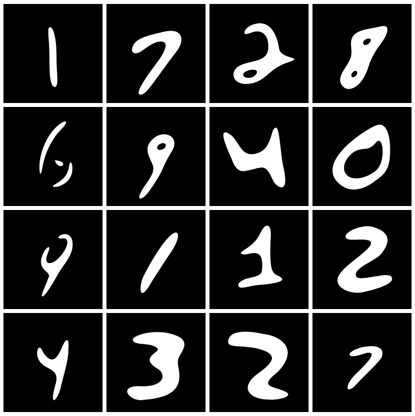

# bezier-mnist

This is a work-in-progress vector version of the MNIST dataset.

# Samples

Here are some samples from the training set. Note that, while these are rasterized, the underlying images can be rendered at any resolution because they are smooth vector graphics.

